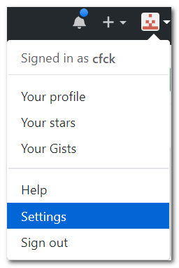
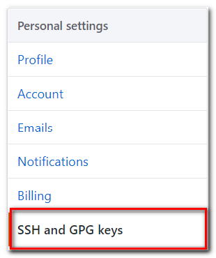

# 环境准备

github 平台是一个使用 git 版本管理工具的代码托管与社交编程平台，注册github账号后，先在本地安装、配置本地 git 环境，按照以下步骤操作：
## 安装git
[git安装](https://git-scm.com/)
## 配置git环境
安装完成后，首次使用前需要配置「全局用户名及邮箱」：   
```
$ git config --global user.name "yourname"
$ git config --global user.email "youremail"
```
yourname：用户名会在代码提交后显示  
youremail：此处的邮箱为github账号注册使用的邮箱，用来提交代码  
必须要设置用户名及邮箱后才能使用 Git，Git 通过检测用户名和邮箱来跟踪进行 commit 的用户，在每次提交代码时这些信息将会附加在提交信息当中。
### 检查配置
可以使用如下命令检查配置是否正确：  
```
$ git config --list
```
## 添加 SSH 公钥
公钥是 github 识别用户身份的一种认证方式，通过公钥进行上传/下载代码。
### 生成公钥
使用你的邮箱生成SSH Key（Windows下需在Git Bash中输入）  
```
$ ssh-keygen -t rsa -C "youremail@huawei.com"
```  
回车后会依此询问你 ssh_key 文件保存的位置以及密码，这里均使用默认即可。直接一路按回车。  
```
$ ssh-keygen -t rsa -C "youremail@huawei.com"
# Creates a new ssh key, using the provided email as a label  
Generating public/private rsa key pair.  
Enter file in which to save the key (/c/Users/you/.ssh/id_rsa): [Press enter] 
Enter passphrase (empty for no passphrase): [Type a passphrase]  
Enter same passphrase again: [Type passphrase again]
```
顺利完成后会看到如下提示：
```
Your identification has been saved in /c/Users/you/.ssh/id_rsa.
Your public key has been saved in /c/Users/you/.ssh/id_rsa.pub.
The key fingerprint is:
01:0f:f4:3b:ca:85:d6:17:a1:7d:f0:68:9d:f0:a2:db youremail@huawei.com
```
该命令会在用户主目录（在这里即为/c/Users/you/）里生产.ssh文件夹，里面有 id_rsa和id_rad.pub 两个文件，这两个文件就是 SSH Key 的秘钥对。其中，id_rad是私钥，不能泄露，id_rsa.pub是公钥，可以告诉别人。
###在 github 添加公钥
登录github，进入用户的SSH Keys设置页面:  

  

点击右上角的添加按钮，  
  
进入添加Key页面，将公钥 id_ras.pub 文件中的内容赋值到 Key 中，并在 Title 中添加一个标识名称，然后保存即可。

**注意:**
* 复制公钥时不要复制多余的空格，否则可能添加不成功。
* 设置SSH Key的目的是让github验证提交commit人的身份，防止他人随意提交。如果你有若干台电脑，可以在github上添加多个Key。

设置成功之后，可以使用github进行托管代码了！

## 获取代码
在Git Bash下执行命令：
```
git clone https://github.com/OpenTelekomCloud/otc-autodeploy.git otc
```
命令执行后会在当前目录创建otc目录，并将代码获取到这个目录中

## 代码编辑
推荐几种好用的免费编辑工具，随便选一种即可：
pycharm
visual studio code
atom
gvim